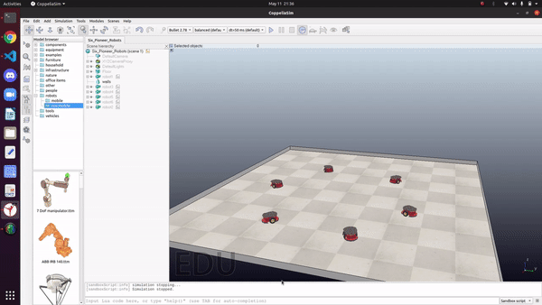

# Graph NNs and RL for Multi-Robot Motion Planning

This repository contains the code and models necessary to replicate the results of our work:



The main idea of our work is to develop a deep learning model powered by Graph Neural Networks and Reinforcement Learning to build a multi-agent path planning algorithm that generalizes to different network topologies, while mainting fast communication and efficient convergence.

I wrote a blog about all our work [here](https://husseinlezzaik.github.io/2022/12/02/MultiRobotics/).

## Overview of the Repository

The major content of our repo is:

* `Two Robots Topology Graph`: code for building our GNN model for two robots.
* `Real Topology Graph`: code for building our scalable robust GNN model.
* `Reinforcement Learning`: code for building our custom gym environment & DQN model powered by GNN.

Note: please check the `README` of each repository to dive deeper into the code and be able to replicate our results. Also, for more architecture details and results please read here.

## Getting Started
Our code relies on using [CoppeliaSim](https://www.coppeliarobotics.com/)  for simulating our experiments on robots, and [ROS2 Foxy](https://docs.ros.org/en/foxy/index.html) for publishing speed commands to our robots. 

1.  Clone our repo: `git clone https://github.com/HusseinLezzaik/Multi-agent-path-planning.git`

2.  Install dependencies:
    ```
    pip install -r requirements.txt
    ```
    
3. Install [CoppeliaSim edu](https://www.coppeliarobotics.com/downloads).

4. Install [ROS2 Foxy](https://docs.ros.org/en/foxy/Installation.html) and make sure that the [ROS2 Interface](https://www.coppeliarobotics.com/helpFiles/en/ros2Interface.htm) works.

5. Make sure the [Python Remote API](https://www.coppeliarobotics.com/helpFiles/en/remoteApiFunctionsPython.htm) works.

6. Install [Gym Environment](https://gym.openai.com/docs/) from OpenAI in order to use our custom environment for RL training.

## Simulation in V-Rep 
We tested our algorithms on [BubbleRob Scene](https://www.coppeliarobotics.com/helpFiles/en/externalControllerTutorial.htm) from CoppeliaSim, however our model can be used with all kinds of robots.

## Data Collection 
Using  [Python's Remote API](https://www.coppeliarobotics.com/helpFiles/en/remoteApiFunctionsPython.htm) for CoppeliaSim, we initialized the positions randomly for each scene and ran the expert consensus algorithm to collect labelled data in a
imitation learning framework (Behavioural Cloning). We tested on different architectures for the GNN, and in each scene we stopped collecting data for d=0.2 ie when they meet.

## Acknowledgement
We would like to thank [Claudio Pacchierotti](https://team.inria.fr/rainbow/team/claudio-pacchierotti/) for his constructive comments and discussions.

## Contact
If you have any question, or if anything of the above is not working, don't hestitate to contact us! We are more than happy to help!
* [Hussein Lezzaik](https://www.husseinlezzaik.com/) (hussein dot lezzaik at gmail dot com)
* [Gennaro Notomista](https://www.gnotomista.com/) (g dot notomista at gmail dot com)
* [Marco Cognetti](https://www.maynoothuniversity.ie/faculty-science-engineering/our-people/marco-cognetti) (Marco dot Cognetti at mu.ie)
