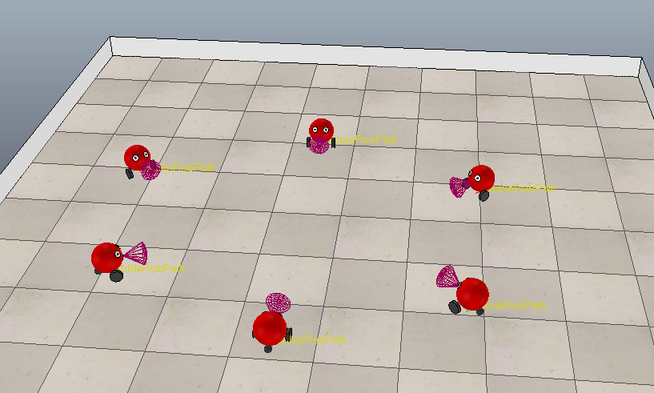

# Scalable Graph Neural Network
Graph Neural Net for six robots to perform consensus.

  
   

### Table of Content

- [Consensus Algorithms](#Consensus%20Algorithms)
- [Data Collection](#Data%20Collection)
- [GNN Model 1](#GNN%20Model%201)
- [GNN Model 2](#GNN%20Model%202)
- [GNN Model 3](#GNN%20Model%203)
- [GNN Model 4](#GNN%20Model%204)

For running our same robotic scene load `Data Collection/Scene_of_Six_Robots.ttt`

## Consensus Algorithms

* `main_consensus_algorithm_fully_connected.py`: code for consensus algorithm for six mobile robots Full Graph adjacency matrix.
* `main_consensus_algorithm_line_graph.py`: code for consensus algorithm for six mobile robots Line Graph adjacency matrix.
