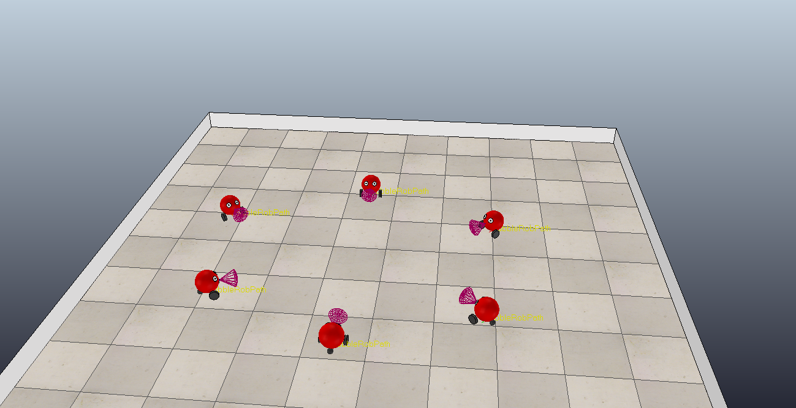

# Custom Environment of gym for Vrep
This is an implementation of the Vrep Simulator as a gym environment. It can be used to make robots learn interacting with the physical environment.

We built our gym environment from scratch by integrating it with V-Rep.

### Table of Content

- [CoppeliaSim Scene](#CoppeliaSim%20Scene)
- [Gym Environment](#Gym%20Environment)
- [Deep Q-Learning](#Deep%20Q-Learning)

## CoppeliaSim Scene
In order to run our scene, please load `examples/scenes/Scene_of_Six_Robots.ttt`

## Gym Environment
To use our custom environment, check `examples/scenes/mobile_robot_env _gym.py`

## Deep Q-Learning
We used Deep Q-Learning algorithm to train the agent, and integrated the GNN model developed before as the deep neural network used in DQN. 

## Acknowledgement

We used [Vrep-Env](https://github.com/ycps/vrep-env#vrepcartpole-v0) for building the skeleton of our custom environment.