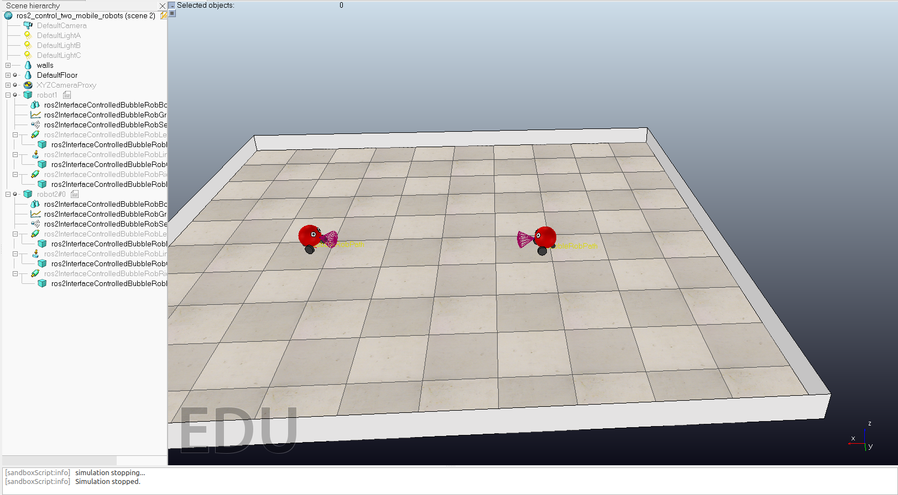
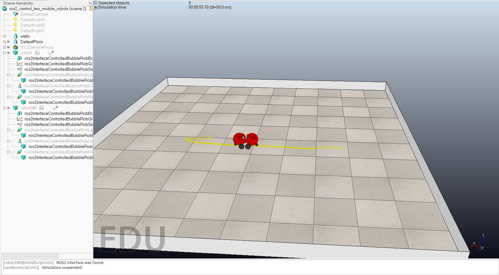

# Graph Neural Nets for Two Robots
Graph Neural Net for two robots for consensus.

  
   

### Table of Content

- [Consensus Algorithm](#Consensus Algorithm)
- [Data Collection](#Data Collection)
- [GNN Model](#GNN Model)
- [Pose Transformer](#Pose Transformer)
- [ROS2 Speed Publisher](#ROS2 Speed Publisher)

## Training data
For our first experiment, we collected two dataset's for each corresponding robot. We later will use this data to train our first graph neural networks architecture on, 
which takes the relative position of each robot i w.r.t robot j in the local transformation frame and it's corresponding control input Uj as an output. Value's are saved within two seperate 
CSV files for each robot. 

We first run a vanilla consensus algorithm, and start collecting data of relative poses for robot i w.r.t robot j and it's corresponding local input for each robot.